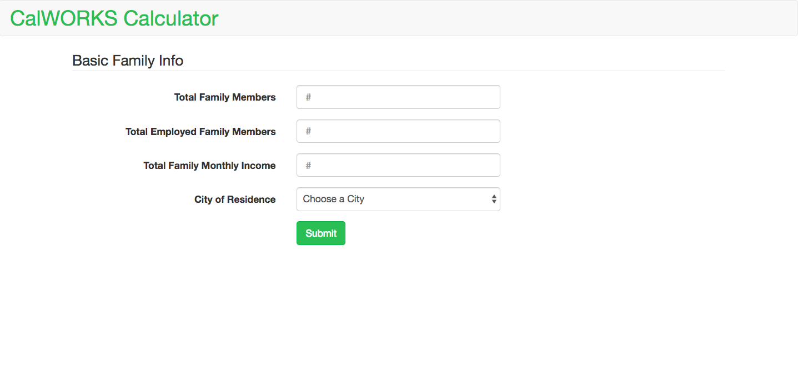
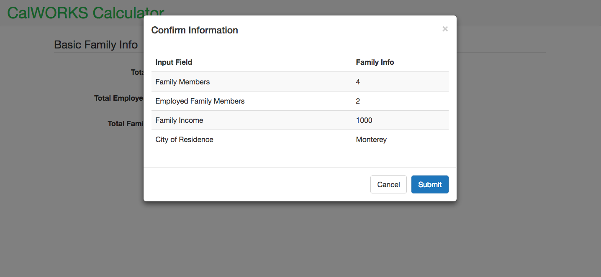
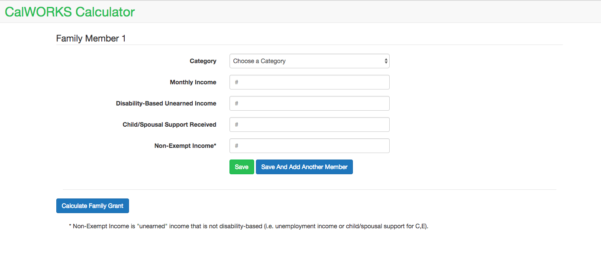
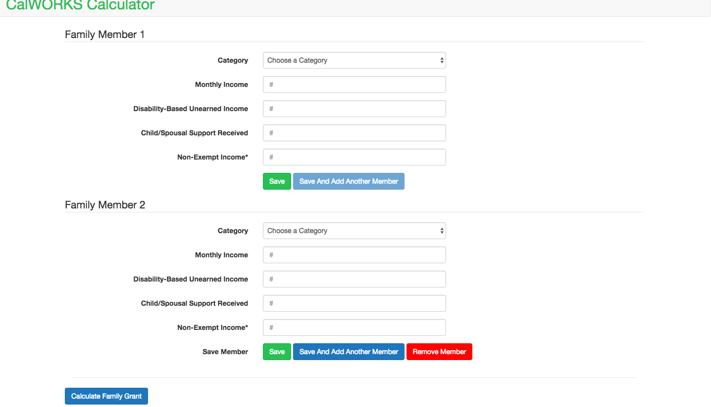
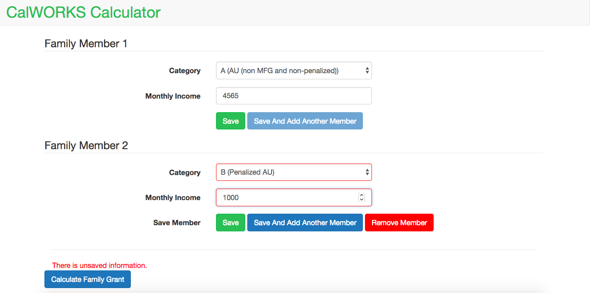
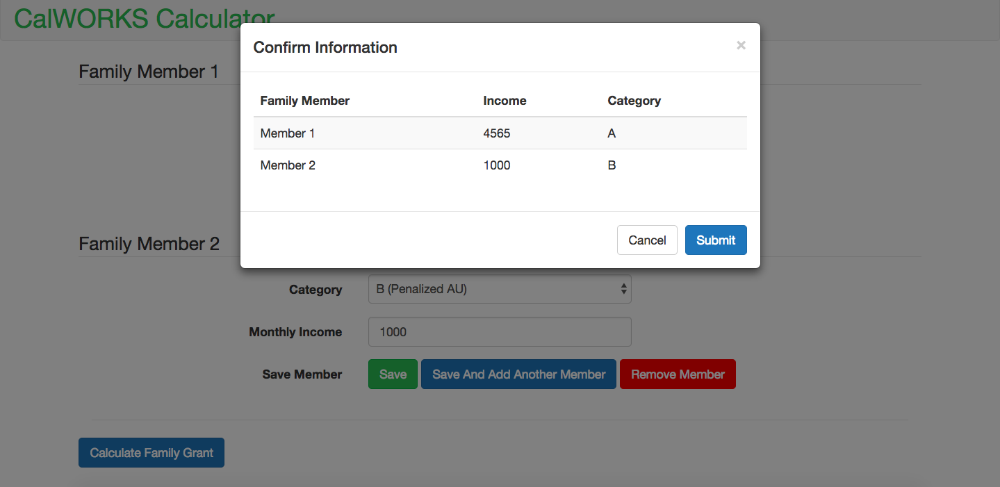

# CALWorks Calculator
visit at [https://calworks-calc.herokuapp.com/](https://calworks-calc.herokuapp.com/)

The CALWorks Calculator is designed to help non-profit workers estimate the CALWorks grant a family will receive.

## Contents
* [Technologies](#technologies)
* [Features](#features)
* [Installation](#install)
* [Testing](#testing)
* [To Do](#todo)

## <a name="technologies"></a>Technologies
<b>Backend:</b> Python, Flask<br/>
<b>Frontend:</b> JavaScript, jQuery, Jinja2, Bootstrap, HTML5, CSS3<br/>

## <a name="features"></a>Features
User fills out inital information on a family


They need to confirm information


If the family passes the net income test, they will fill out more information on the family


They can add and remove members


And will be reminded to save before submitting


Once again, they can review information before submitting


They will then get the family's grant amount


Or a sorry message


## <a name="install"></a>Installation
To run CALWorks Calculator:


Clone or fork this repo:

```
https://github.com/KSaryan/CalWORKS-Calc
```

Create and activate a virtual environment inside your CalWORKS-Calc directory:

```
virtualenv env
source env/bin/activate
```

Install the dependencies:

```
pip install -r requirements.txt
```

Run the app:

```
python server.py
```

You can now navigate to 'localhost:5000/' to access CALWorks Caculator.


## <a name="testing"></a> Testing
To run tests:

```
python calworks.py
```

## <a name="todo"></a> To Do

- [X] Last of backend logic for calculating grant
- [X] Finish unit testing in calworks.py
- [ ] Footnotes
- [ ] Integration testing
- [X] Launch
