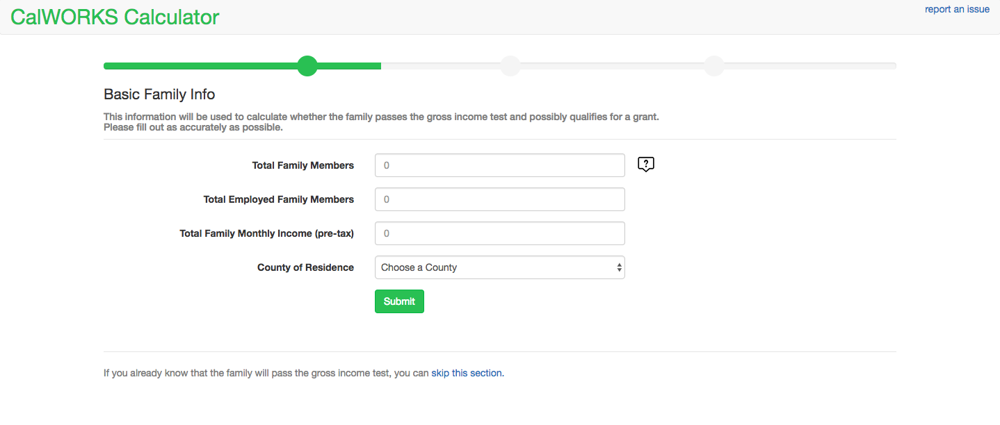
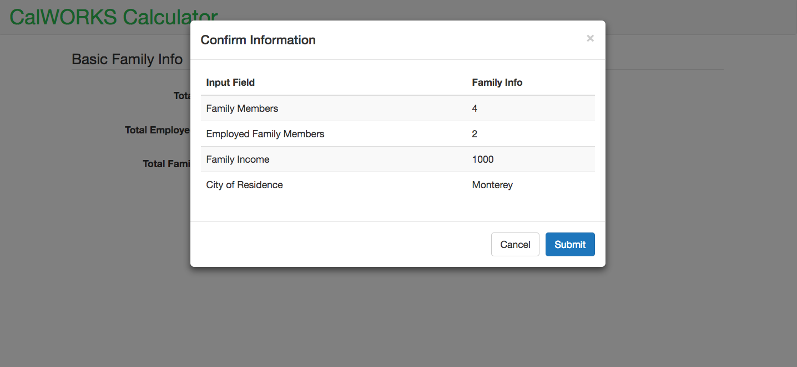
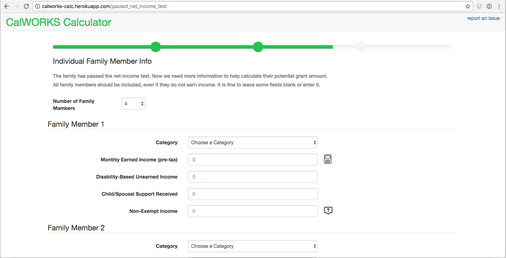
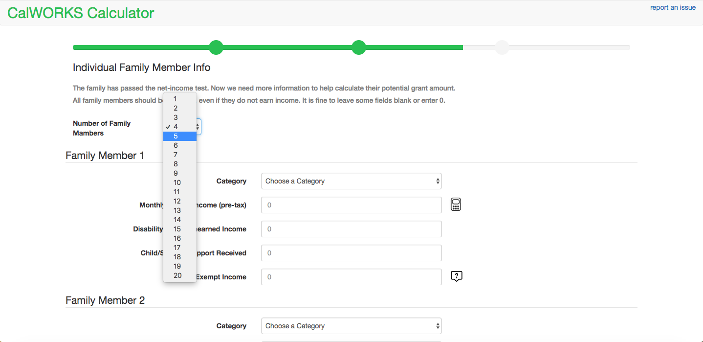
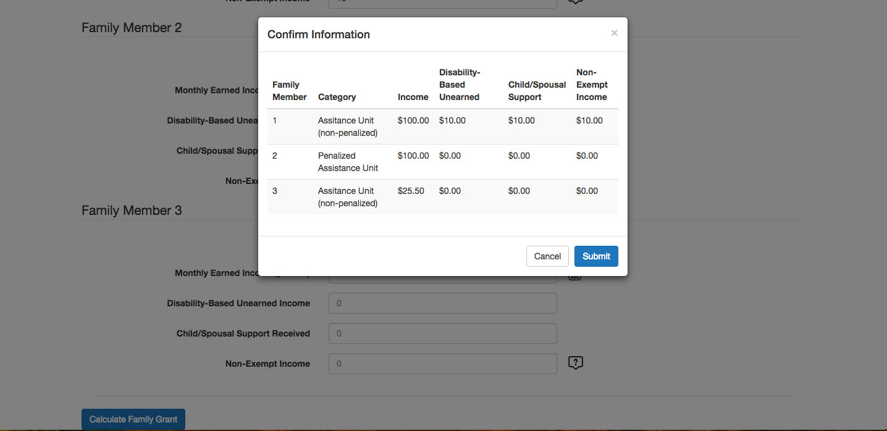
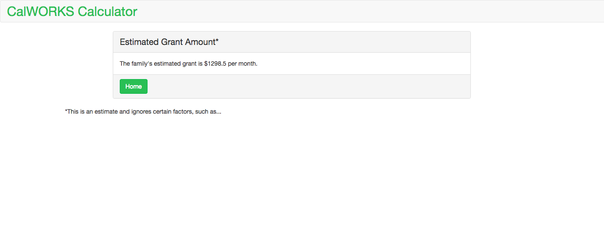
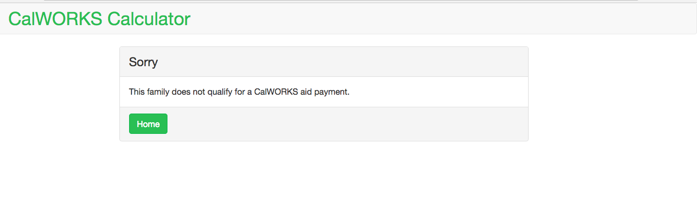

# CALWorks Calculator
visit at [https://calworks-calc.herokuapp.com/](https://calworks-calc.herokuapp.com/)

The CALWorks Calculator is designed to help non-profit workers estimate the CALWorks grant a family will receive.

## Contents
* [Technologies](#technologies)
* [Features](#features)
* [Installation](#install)
* [Testing](#testing)
* [To Do](#todo)

## <a name="technologies"></a>Technologies
<b>Backend:</b> Python, Flask<br/>
<b>Frontend:</b> JavaScript, jQuery, Jinja2, Bootstrap, HTML5, CSS3<br/>

## <a name="features"></a>Features
User fills out inital information on a family


They need to confirm information


If the family passes the gross income test, they will fill out more information on the family


They can adjust how many members are in their family


Once again, they can review information before submitting


They will then get the family's grant amount


Or a sorry message



## <a name="install"></a>Installation
To run CALWorks Calculator:


Clone or fork this repo:

```
https://github.com/KSaryan/CalWORKS-Calc
```

Create and activate a virtual environment inside your CalWORKS-Calc directory:

```
virtualenv env
source env/bin/activate
```

Install the dependencies:

```
pip install -r requirements.txt
```

Run the app:

```
python server.py
```

You can now navigate to 'localhost:5000/' to access CALWorks Caculator.


## <a name="testing"></a> Testing
To run unit tests and Selenium tests:

1. `python app.py`

2. in a separete terminal window:
```
python tests.py
```

To run  Jasmine tests:

```
python app.py jstest
```


## <a name="todo"></a> To Do

- [X] Last of backend logic for calculating grant
- [X] Finish unit testing in calworks.py
- [X] ~~Footnotes~~ Tooltips
- [X] Integration testing
- [X] Launch
- [X] Integrate client feedback
- [X] Add way to calculate income from self-employment 
- [X] Jasmine testing
- [ ] More Selenium testing
